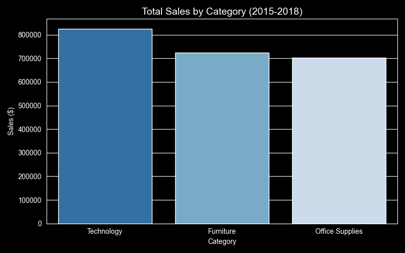
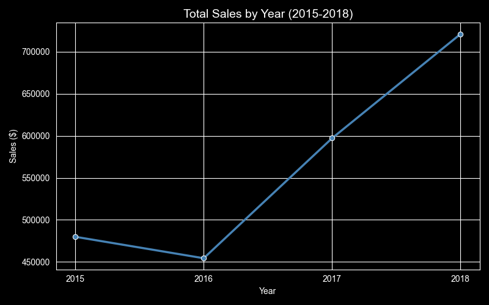
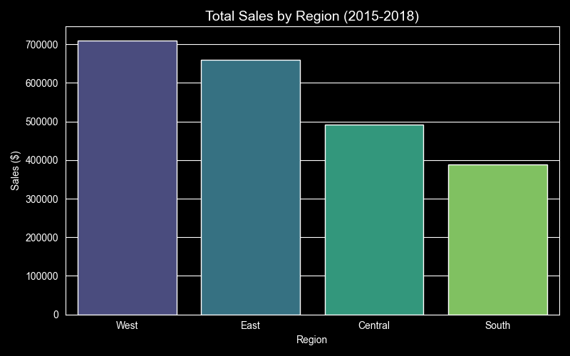

# Sales Performance Dashboard (2015-2018)

## Overview
Analysis of retail sales data from a US superstore using Python and Excel.
Identified trends across product categories, regions, and years.

## Key Findings
- Technology is the top-selling category with $825,856 in total sales
- West region leads with $710,219 in sales, South is the weakest at $389,151
- Sales declined in 2016 but grew consistently to $721,209 in 2018

## Tools Used
- Python, pandas, matplotlib, seaborn
- Excel (charts, dashboard)

## Visualizations

## Dataset
Source: Kaggle - Superstore Sales Dataset
https://www.kaggle.com/datasets/rohitsahoo/sales-forecasting
